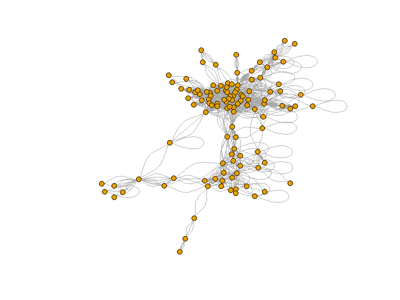

# Gene Expression Protein Interaction

Protein Network Analysis: Identifying Hub Proteins from BIOGRID-MV-Physical-4.4.247.tab3.zip

## Contents
- `top_hubs.rds` → R object containing hub proteins identified from the network.
- `protien_hubs.csv` → Subnetwork of hub proteins and their interactions.
- `subnetwork_plot.png` → Visualization of the subnetwork.

## Methods
- Built a PPI network using igraph in R.
- Identified hub proteins based on degree centrality.
- Extracted a subnetwork of the most connected proteins.
- Visualized the network to highlight potential key regulators.

##Tools and skills
R, igraph, network visualization, BIOGRID, hub analysis

## Purpose
This small project was completed as part of my R programming and bioinformatics learning.  
It demonstrates basic skills in:
- R (data wrangling + igraph)
- Network biology concepts
- Reproducible research with GitHub

## Plot

## Impact

Identified key hub proteins potentially critical in homo sapiens via network analysis.

